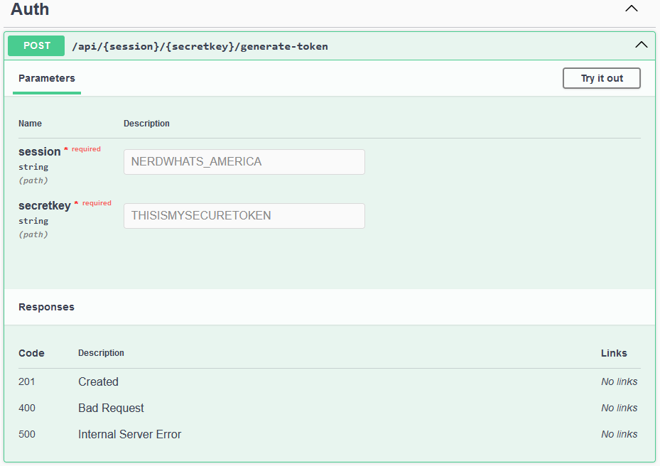

# wppconnect-server
An up and running WPPConnect Whatsapp BOT API server

## Usage

### 1. Run the container
```
docker run -d --name my-wppconnect-server -p 21465:21465 areesmoon/wppconnect-server
```
Note: 21465 is the internal container API port, we expose it to port 21465 for the ease of use

## Authentication

### 1. Accessing the API pages
Simply navigate to http://localhost:21465/api-docs/ and you will se the ready to use API pages.

### 2. Generating token
In the above page, you can generate token by drilling down the first row `[POST] /api/{session}/{secretkey}/generate-token`. Default session name and secret key is provided, just click [Execute](#) to create it. Save the post result on a notepad for next use.



Generated token format:

```
{
  "status": "success",
  "session": "NERDWHATS_AMERICA",
  "token": "$2b$10$vmnO6XA4RDOKkyEIOoKhO.sgC5nfoMYeeEsMK7O_tPOsnItQxr2VW",
  "full": "NERDWHATS_AMERICA:$2b$10$vmnO6XA4RDOKkyEIOoKhO.sgC5nfoMYeeEsMK7O_tPOsnItQxr2VW"
}
```

### 3. Using the token
Click on button Authorize on the top (a bit down) of the page, enter the generated token and then click Authorize. Now your API is ready to use

## API Usage

WPPConnect Whatsapp BOT server is behaving almost-like the Whatsapp Web, because actually the library is animating a real browser in the background. That is why the following steps must be done to make WPPConnect Whatsapp Server working.

### 1. start-session
Starting a session resembles to opening a browser and navigating to https://web.whatsapp.com. Open `[POST] /api/{session}/start-session` in the API page.

### 2. qrcode-session
QRCode session resembles to viewing the QRCode generated on the whatsapp page. Open `[GET] /api/{session}/qrcode-session` in the API page, a QR Code will be shown, be ready to scan the code.

### 3. status-session
Status session means checking the current session, unlike the real whatsapp web, if the barcode is not scanned within 60 seconds, the page will automatically be closed (status = CLOSED). Open `[GET] /api/{session}/status-session` in the API page to check the current session status.

#### Whatsapp Status Cycle (After start-session):
  1. INITIALIZING
  2. QRCODE
  3. CONNECTED (IF SCANNED)
  4. CLOSED

Note: if QRCode is not scanned during QRCODE cyle within 60 seconds, the status will become CLOSED and we must invoke start-session again to request the new QRCode.

### 4. close-session
Invoke this `[POST] /api/{session}/close-session` to close the current session, closing session means closing whatsapp web page without logging out. But sometimes closing session makes the previous login lost (and we have to re-scan QR code). To reopen the closed session, use start-session again.

### 5. logout-session
Invoke this `[POST] /api/{session}/logout-session` to logout the current session.